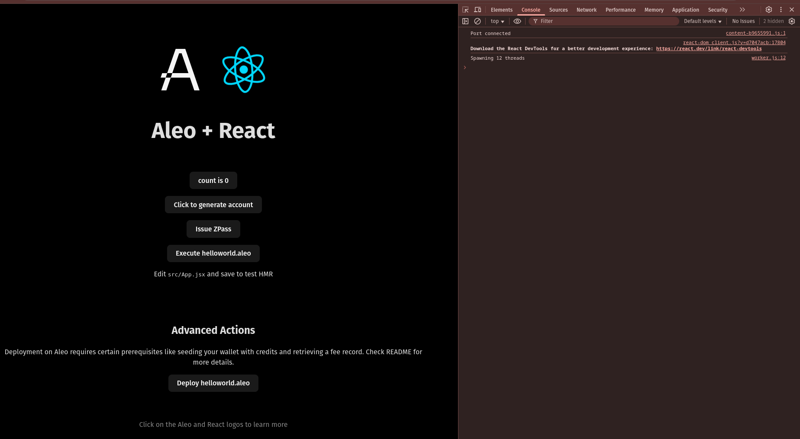

# ZPass Integration

## Create React Leo App:
- Command:
    ```sh
    npm create leo-app@latest
    ```
    
    <details><summary> Detailed Output </summary><blockquote>

    ~~~sh
    > npx
    > create-leo-app

    ✔ Project name: … saugatstha_leo_zpass_integration
    ✔ Select a framework: › React
    ✔ Select a variant: › JavaScript + Leo

    Done. Now run:

    cd saugatstha_leo_zpass_integration
    npm install
    npm run dev
    ~~~

    </blockquote></details>

- Install Dependencies:
    ```sh
    npm i zpass-sdk vite-plugin-wasm
    ```

## Start Project:
- Command:
    ```sh
    npm run dev
    ```
- Then, visit [http://localhost:5173](http://localhost:5173).

    

- Click in `Issue ZPass` Button:
    


- Here, in my case Transaction ID: `at18ffh03l85t6q9mfpm8qvwu0fc99p2ua3x3ewkhultpu8ma37uyzqvtt2gj`

# Signature:
## Sign with `Transaction ID`:
- For me, program deployed Transaction ID is: `at18ffh03l85t6q9mfpm8qvwu0fc99p2ua3x3ewkhultpu8ma37uyzqvtt2gj`. Command:
    ```sh
    leo account sign -d --private-key <redacted> --message "at18ffh03l85t6q9mfpm8qvwu0fc99p2ua3x3ewkhultpu8ma37uyzqvtt2gj" --raw
    ```
- Output:
    ```sh
    sign15qus5mxda08ra8w88g46myjuhsq5dhzs00gj9v4zyh09s3r5mqplz0l53ahn9dq2r238f22gzfrr9gwrdw2dsujfaywttapa9fc3xq3eqq3cj89tatjmwmxa89tme9lwtgzzqh9jt8g4uwtnm2nj98lppwdncktrq4xqtajq8y3sv40wsdtmwppd5lkvz4atxy3w3lqeewhqc2a92v4
    ```