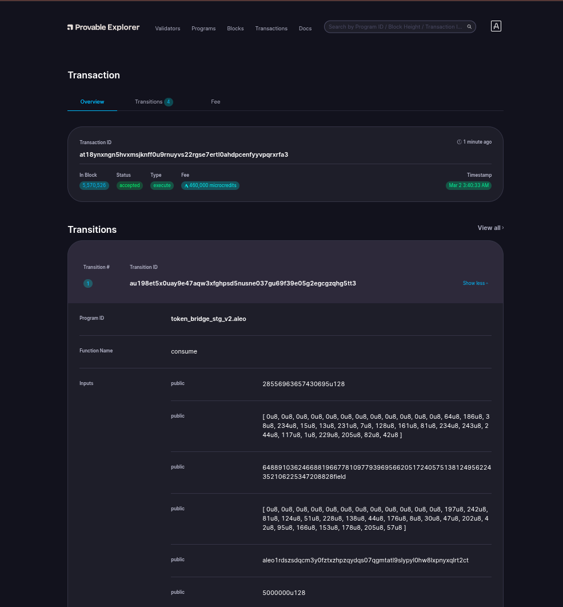

# Bridging On Aleo

- Transaction ID: `at18ynxngn5hvxmsjknff0u9rnuyvs22rgse7ertl0ahdpcenfyyvpqrxrfa3`.
  
    

- Here, I transferred 5 USDC from ETH Sepolia Network to ALEO Testnet.

# Signature:
## Sign with `Transaction ID`:
- For me, program deployed Transaction ID is: `at18ynxngn5hvxmsjknff0u9rnuyvs22rgse7ertl0ahdpcenfyyvpqrxrfa3`. Command:
    ```sh
    leo account sign -d --private-key <redacted> --message "at18ynxngn5hvxmsjknff0u9rnuyvs22rgse7ertl0ahdpcenfyyvpqrxrfa3" --raw
    ```
- Output:
    ```sh
    sign12uk3hqtsxt0nntahv40ups6l9urh5mnlfrjzwkqtp3vlpwhdxcpp6p9rx0az4a2h5axp3w3v7kmk36skgkfp2djfuk488efxuztvjqeeqq3cj89tatjmwmxa89tme9lwtgzzqh9jt8g4uwtnm2nj98lppwdncktrq4xqtajq8y3sv40wsdtmwppd5lkvz4atxy3w3lqeewhqcgkt9fu
    ```